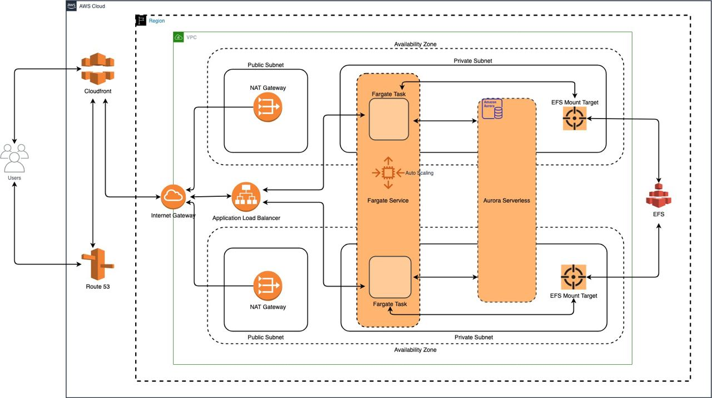

# Serverless WordPress Deployment on AWS Infrastructure using Terraform

This repository contains Terraform configuration files to deploy a WordPress application on AWS infrastructure. The deployment consists of an Amazon Aurora Serverless MySQL database, an Application Load Balancer (ALB), Elastic File System (EFS), and an Amazon ECS Fargate service for hosting WordPress.

## Table of Contents

- [Architecture Overview](#architecture-overview)
- [Prerequisites](#prerequisites)
- [Getting Started](#getting-started)
- [Files and Modules](#files-and-modules)
- [Variables](#variables)
- [DevOps Best Practices](#devops-best-practices)
- [Contributing](#contributing)
- [License](#license)

## Architecture Overview

The solution follows a modern architecture leveraging AWS managed services. Here's a high-level overview of the architecture:



1. **VPC and Subnets**: A Virtual Private Cloud (VPC) is created with public and private subnets spread across multiple Availability Zones (AZs).

2. **Internet Gateway (IGW)**: An Internet Gateway is associated with the VPC to allow communication between instances in the VPC and the internet.

3. **NAT Gateways**: NAT Gateways are deployed in the public subnets to enable instances in the private subnets to access the internet while keeping them isolated from inbound traffic.

4. **Aurora Serverless Database**: An Aurora Serverless MySQL database is provisioned to store WordPress data.

5. **Elastic File System (EFS)**: EFS is used as a shared filesystem for WordPress uploads and other media content.

6. **ALB and CloudFront**: An Application Load Balancer (ALB) is deployed to distribute incoming traffic to the ECS Fargate service. CloudFront is used to provide a Content Delivery Network (CDN) for improved performance and security.

7. **ECS Fargate Service**: The WordPress application is containerized and run using ECS Fargate.

## Prerequisites

Before you begin, ensure you have the following:

- AWS account with necessary permissions
- AWS CLI installed and configured with your credentials
- Terraform (v1.5.5) installed on your local machine

## Getting Started

1. Clone this repository to your local machine:

   ```sh
   git clone https://github.com/olektretiak/wp_on_fargate.git
   cd wordpress-aws-terraform
   ```

2. **Set Up an S3 Bucket for Terraform Remote State**: It's recommended to use an S3 bucket to store Terraform state due to its reliability and collaboration features. Please note that S3 bucket names must be globally unique across AWS accounts. Configure the `backend` section in `provider.tf` to use the created S3 bucket for remote state storage.

3. Create a `terraform.tfvars` file and provide values for the required variables. Here's an example:

   ```hcl
   prefix              = "wordpress"
   site_domain         = "example.com"
   public_alb_domain   = "wordpress.example.com"
   create_certificate  = true
   existing_certificate_arn = ""
   # Other variables...
   ```

4. Initialize Terraform:

   ```sh
   terraform init
   ```

5. Review the changes that will be applied:

   ```sh
   terraform plan
   ```

6. Apply the Terraform configuration:

   ```sh
   terraform apply
   ```

## Usage

After successful deployment, you'll have a WordPress application up and running on your AWS infrastructure. The application can be accessed through the CloudFront distribution URL or the ALB's DNS name, based on the provided variables.

To destroy the infrastructure:

```sh
terraform destroy
```

## Files and Modules

The configuration is divided into separate `.tf` files, each responsible for creating different resources. Here are the main files:

- `acm_route53.tf`: Configures ACM certificates and Route 53 DNS records for the domain.
- `alb.tf`: Creates the Application Load Balancer and related resources.
- `cloudfront.tf`: Defines the CloudFront distribution for content delivery.
- `db.tf`: Sets up the Aurora Serverless database.
- `efs.tf`: Configures the Elastic File System for media storage.
- `fargate.tf`: Defines the ECS Fargate service for WordPress hosting.
- `data.tf`: Retrieves current AWS region, caller identity, and availability zones.
- `output.tf`: Defines outputs for various resources created in the configuration.
- `provider.tf`: Configures the Terraform providers and backend.
- `variables.tf`: Defines input variables used throughout the configuration.
- `vpc.tf`: Utilizes the `terraform-aws-modules/vpc/aws` module to create the VPC.

## Variables

The `variables.tf` file defines various input variables used in the configuration. These variables allow you to customize your deployment according to your requirements. An example `terraform.tfvars` file is provided for your convenience.

## DevOps Best Practices

This project adheres to DevOps best practices in

 its architecture and implementation:

- **Infrastructure as Code (IaC)**: The entire infrastructure is defined using Terraform configuration files, ensuring version control and reproducibility.
- **Modularization**: The configuration is split into separate files and modules, making it easier to manage and understand.
- **Tagging Strategy**: Resources are tagged with relevant metadata to aid in organization, cost allocation, and management.
- **Separation of Concerns**: Different resources are created using individual files, promoting modularity and easy troubleshooting.
- **Immutable Infrastructure**: Infrastructure updates are achieved by creating new resources and updating references, ensuring consistency and reducing risk.
- **Infrastructure Versioning**: Terraform state is stored remotely in an S3 bucket, allowing collaboration and preventing state loss.
- **Security Considerations**: Security groups and IAM roles/policies are defined to provide least privilege access to resources.
- **Scalability**: AWS managed services like Aurora Serverless and Fargate enable automatic scalability.

## Contributing

Contributions are welcome! If you find any issues or improvements, feel free to create a pull request or submit an issue in this repository.

## License

This project is licensed under the [MIT License](LICENSE).

```
